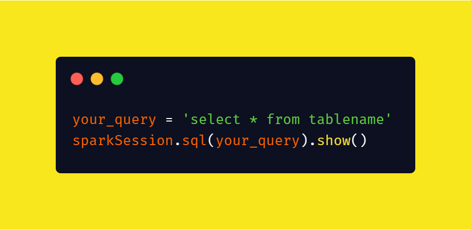

# Spark Even More! (Bonus)



**PS: This assignment is not mandatory if you think you collected enough points. Tough, it is always good to practice more!**

You will implement various ways of using Spark. The goal in this assignment is to use functionalities of spark.

Hint: All the answers of the tasks given below, you can find it right in the [Spark Python Documentation](https://spark.apache.org/docs/latest/api/python/index.html).

## Introductory Knowledge and Information

Using Spark SQL and Spark DataFrame can be achieved in the following format.

### Spark SQL

To do the tasks with Spark SQL, you need to implement the tasks by writing SQL queries and executing your results with Spark SQL.

``` py
your_query = 'select * from tablename'
sparkSession.sql(your_query).show()
```

### Spark DataFrame

To do the tasks with Spark DataFrame, you need to use pyspark.sql.DataFrame functions like below.

``` py
data.select(...).groupBy(...)
```

## Dataset

You can use the [Amazon Product Review Dataset](https://nijianmo.github.io/amazon/index.html) with the whole dataset or the smallest one, or **any other dataset that you feel comfortable with**. You may need two datasets at least to be able to perform some operations, such as *joins*.

For amazon product review dataset, review and the metadata datasets could be your two datasets. 

You can use small and simple datasets, you can create the dataset on your own, since some of the tasks may require multiple datasets.

## Tasks

Here in this assignment, you need to the following.

> Create a notebook where you read a dataset, explore the dataset in various ways, extract some statistics, and showcase your results.

There will be following headings.

1. Explore configuration options on SparkSession 
2. Explain the difference between `SQLContext`, `SparkSession`, `SparkContext`, `SparkConf`.
    - Use these classes in an example.
2. Exploring the data with Spark SQL
3. Exploring the data with Spark DataFrame

### 1. Explore Spark Configuration Tasks

- [ ] Find **at least 5** different option of spark and initiate your spark session based on these options.

An example of one way of setting the config is like the following.

``` py
SparkSession.builder.config("spark.some.config.option", "some-value")
```

- [ ] Use each of the `SQLContext`, `SparkSession`, `SparkContext`, `SparkConf` classes and explain in detail the differences on each. Explain the differences and when to use which one.

### 2. Read Data Tasks

From the list below, do **all** of the operations.

- [ ] Read data as RDD
- [ ] Read data as DataFrame
- [ ] Convert RDD to Spark DataFrame
- [ ] Convert Spark DataFrame to RDD
- [ ] Convert Spark DataFrame to Pandas DataFrame

### 3. Exploration Tasks

From following tasks, you need to do **at least 8** of them to get the full points in both ways, by `writing SQL queries` and by using `pyspark.sql.DataFrame` functions. 

You **must show the result**  of your task by showing **first few rows** of your dataset, if not the rows, similarly, the aggreated result from your code.

- [ ] Select first 10 rows of dataset.
- [ ] Show the schema of of the dataset.
- [ ] Group by and get max, min, count of a column in the dataset.
- [ ] Filter your dataset by some conditions based on your column.
- [ ] Apply group by with having clause.
- [ ] Apply order by.
- [ ] Apply inner join/ left join/ right join on your two tables.
- [ ] Select distinct records by a column.
- [ ] Register a user defined function to Spark and use it in your Spark SQL Query.
- [ ] Transform the data type of columns from int to string/ string to integer.
- [ ] Apply a min-max normalization on any numerical column.
- [ ] Apply a standard normalization on any numerical column.
- [ ] Transform a categorical column with OneHot Encoding.
- [ ] Use Spark.sql.DataFrameStatFunctions to collect statistics from the data. 
    - Get covariance
    - Get correlation
    - Get crosstab
    - Get freqItems

## What are all these other files?

Following table is will give it a meaning for each file.

File                | Description 
-------             | ----------- 
README.md **        | A descriptive file to give an introduction of current project/ assignment. 
Instructions.md **  | A copy of current README.md file. 
LICENCE **          | The licence of the file that every project should have.
.gitignore          | The file to control which files should be ignored by Git.
*.ipynb             | Assignment notebook with your Spark code. 
